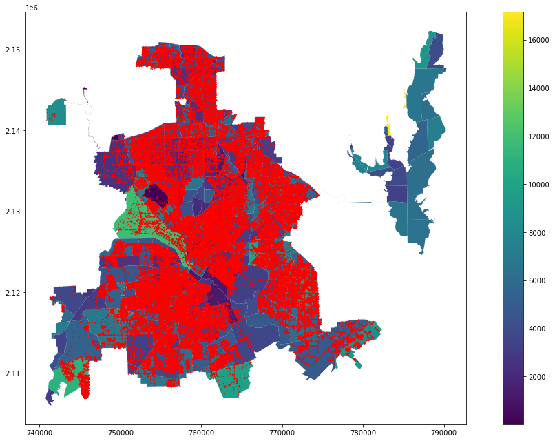
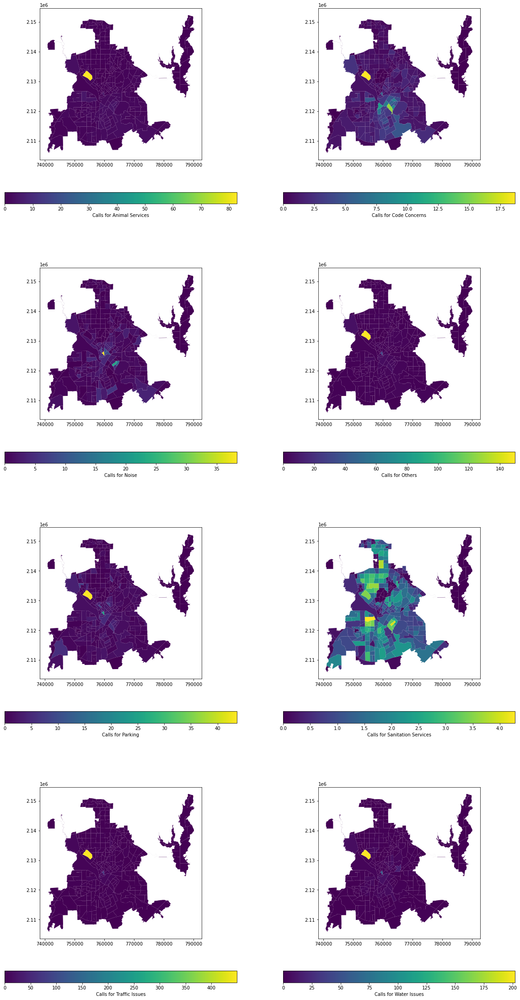
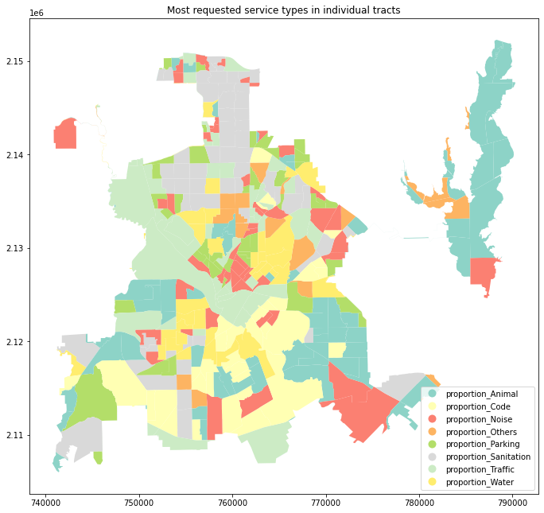

<h1>Table of Contents<span class="tocSkip"></span></h1>
<div class="toc"><ul class="toc-item"><li><span><a href="#import-libraries" data-toc-modified-id="import-libraries-1"><span class="toc-item-num">1&nbsp;&nbsp;</span>import libraries</a></span></li><li><span><a href="#Import-table-and-do-data-cleaning" data-toc-modified-id="Import-table-and-do-data-cleaning-2"><span class="toc-item-num">2&nbsp;&nbsp;</span>Import table and do data cleaning</a></span><ul class="toc-item"><li><span><a href="#Q1" data-toc-modified-id="Q1-2.1"><span class="toc-item-num">2.1&nbsp;&nbsp;</span>Q1</a></span></li><li><span><a href="#Q2" data-toc-modified-id="Q2-2.2"><span class="toc-item-num">2.2&nbsp;&nbsp;</span>Q2</a></span></li><li><span><a href="#Q3" data-toc-modified-id="Q3-2.3"><span class="toc-item-num">2.3&nbsp;&nbsp;</span>Q3</a></span></li></ul></li><li><span><a href="#Convert-the-Dataframe-to-a-point-gdf" data-toc-modified-id="Convert-the-Dataframe-to-a-point-gdf-3"><span class="toc-item-num">3&nbsp;&nbsp;</span>Convert the Dataframe to a point gdf</a></span><ul class="toc-item"><li><span><a href="#Q4" data-toc-modified-id="Q4-3.1"><span class="toc-item-num">3.1&nbsp;&nbsp;</span>Q4</a></span></li><li><span><a href="#Q5" data-toc-modified-id="Q5-3.2"><span class="toc-item-num">3.2&nbsp;&nbsp;</span>Q5</a></span></li><li><span><a href="#Q6" data-toc-modified-id="Q6-3.3"><span class="toc-item-num">3.3&nbsp;&nbsp;</span>Q6</a></span></li><li><span><a href="#Q7" data-toc-modified-id="Q7-3.4"><span class="toc-item-num">3.4&nbsp;&nbsp;</span>Q7</a></span></li><li><span><a href="#Q8" data-toc-modified-id="Q8-3.5"><span class="toc-item-num">3.5&nbsp;&nbsp;</span>Q8</a></span></li><li><span><a href="#Q9" data-toc-modified-id="Q9-3.6"><span class="toc-item-num">3.6&nbsp;&nbsp;</span>Q9</a></span></li><li><span><a href="#Q10" data-toc-modified-id="Q10-3.7"><span class="toc-item-num">3.7&nbsp;&nbsp;</span>Q10</a></span></li><li><span><a href="#Q11" data-toc-modified-id="Q11-3.8"><span class="toc-item-num">3.8&nbsp;&nbsp;</span>Q11</a></span></li></ul></li><li><span><a href="#Plot-the-map-and-save-it" data-toc-modified-id="Plot-the-map-and-save-it-4"><span class="toc-item-num">4&nbsp;&nbsp;</span>Plot the map and save it</a></span><ul class="toc-item"><li><span><a href="#Q12" data-toc-modified-id="Q12-4.1"><span class="toc-item-num">4.1&nbsp;&nbsp;</span>Q12</a></span></li></ul></li></ul></div>

# Lab Package 1.2

## import libraries


```python
import numpy as np
import pandas as pd
import matplotlib.pyplot as plt
import geopandas as gpd
import fiona
from shapely.geometry import Point,Polygon
import descartes
```

## Import table and do data cleaning


```python
service_requests_path = r'data/311_Service_Requests_October_1__2020_to_Present.csv'
service_requests_df = pd.read_csv(service_requests_path,encoding="utf-8")
```


```python
top_service_path = r'data/Top Service Request Types.xls'
top_service_df = pd.read_excel(top_service_path)
```

### Q1
What is the difference between `df['Lat_Long Location']` and `df[['Lat_Long Location']]` ? 
* no difference
* **`df['Lat_Long Location']` is a series**
* `df[['Lat_Long Location']]` is a series 


```python
type(service_requests_df['Lat_Long Location'])
```


    pandas.core.series.Series


```python
type(service_requests_df[['Lat_Long Location']])
```


    pandas.core.frame.DataFrame


### Q2
What are the missing codes `(?)` below to get the numeric portion of the Longitude column? 
`df.Longitude = [x.split('?')[?] for x in df.Longitude] `
* `(` and 0 
* `(` and 1
* **`)` and 0** 
* `)` and 1 


```python
service_requests_df['Lat_Long Location'] = service_requests_df['Lat_Long Location'].astype(str)
```


```python
service_requests_df[['Latitude','Longitude']] = service_requests_df['Lat_Long Location'].str.split(',', expand=True)
```


```python
service_requests_df['Latitude'].head(5)
```


    0    (33.00277709316475000
    1    (32.63890090904497000
    2    (32.92965507406486000
    3    (32.88854894337505600
    4    (32.81745925803681000
    Name: Latitude, dtype: object


```python
service_requests_df.Latitude= [x.replace('(','') for x in service_requests_df.Latitude]
```


```python
service_requests_df['Latitude'].head(5)
```


    0    33.00277709316475000
    1    32.63890090904497000
    2    32.92965507406486000
    3    32.88854894337505600
    4    32.81745925803681000
    Name: Latitude, dtype: object


```python
service_requests_df['Longitude'].head(5)
```


    0    -96.84332884334131000)
    1    -96.95280343146295000)
    2    -96.77182011512204000)
    3    -96.83199911677954000)
    4    -96.82982967652659000)
    Name: Longitude, dtype: object


```python
service_requests_df.Longitude = [x.split(')')[0] for x in service_requests_df.Longitude]
service_requests_df['Longitude'].head(5)
```


    0    -96.84332884334131000
    1    -96.95280343146295000
    2    -96.77182011512204000
    3    -96.83199911677954000
    4    -96.82982967652659000
    Name: Longitude, dtype: object


### Q3
What are the data types for Latitude and Longitude in df?
* **Both are of "object" type**
* Both are of "string" type 
* Both are of "float" type


```python
service_requests_df.Latitude.dtype
```


    dtype('O')


```python
service_requests_df.Longitude.dtype
```


    dtype('O')


```python
service_requests_df.Latitude= pd.to_numeric(service_requests_df.Latitude,errors = 'coerce')
```


```python
service_requests_df.Longitude= pd.to_numeric(service_requests_df.Longitude,errors = 'coerce')
```


```python
service_requests_df.Latitude.dtype
```


    dtype('float64')


```python
service_requests_df.Longitude.dtype
```


    dtype('float64')


**List unique values of a column named 'Service Request Type'**


```python
service_requests_df['Service Request Type'].unique()[:5]
```


    array(['Guardrail - New - TRN', 'Dead Animal Pick Up - DAS',
           'Animal Aggressive Behavior - DAS',
           'Sanitation Missed Recycle - SAN',
           'Parking - Report a Violation - TRN'], dtype=object)


**the number of unique values in the column 'Service Request Type'**


```python
service_requests_df['Service Request Type'].nunique()
```


    205


**List the occurrences for each unique value**


```python
service_requests_df['Service Request Type'].value_counts(ascending = True)
```


    Bond Program Projects - OBP                            1
    Community Prosecution- CAO                             1
    Homeless Encampment                                    1
    Code Concern                                           1
    Boarding Home Facilities  - CCS                        1
                                                       ...  
    Parking - Report a Violation - TRN                 12240
    Water/Wastewater Line Locate - 311                 19747
    Sanitation Missed Garbage - SAN                    21065
    Sanitation Roll Cart Maintenance/Delivery - SAN    31122
    Code Concern - CCS                                 92870
    Name: Service Request Type, Length: 205, dtype: int64


**Capitalize the first letter only, and remove the extra spaces between words, then get the description before `" -"`**


```python
service_requests_df['Service Request Type'] = [x.capitalize().strip().split(' -')[0] for x in service_requests_df['Service Request Type']]
service_requests_df['Service Request Type'].head()
```


    0                     Guardrail
    1           Dead animal pick up
    2    Animal aggressive behavior
    3     Sanitation missed recycle
    4                       Parking
    Name: Service Request Type, dtype: object


**Save the unique values of service request types to a numpy array**


```python
service_type = service_requests_df['Service Request Type'].unique().tolist()
service_type.sort()
service_type[:5]
```


    ['24 hour parking violation',
     'Ada accessibility concerns',
     'Advertising sign violation',
     'Air pollution complaint',
     'Alley repair']


**Join two dataframes based on common values in both dataframes but every row in the left dataframe will retain (`left join`) with the right dataframe on `'Service Request Type"` to match the left dataframe on `'Service Request Type Simple`**


```python
top_service_df_merged = pd.merge(service_requests_df,top_service_df,how='left',left_on='Service Request Type',
                                 right_on='Service_Request_Type_Simple')
top_service_df_merged.head()
```


<div>
<style scoped>
    .dataframe tbody tr th:only-of-type {
        vertical-align: middle;
    }

    .dataframe tbody tr th {
        vertical-align: top;
    }

    .dataframe thead th {
        text-align: right;
    }
</style>
<table border="1" class="dataframe">
  <thead>
    <tr style="text-align: right;">
      <th></th>
      <th>Service Request Number</th>
      <th>Address</th>
      <th>City Council District</th>
      <th>Department</th>
      <th>Service Request Type</th>
      <th>ERT (Estimated Response Time)</th>
      <th>Overall Service Request Due Date</th>
      <th>Status</th>
      <th>Created Date</th>
      <th>Update Date</th>
      <th>Closed Date</th>
      <th>Outcome</th>
      <th>Priority</th>
      <th>Method Received Description</th>
      <th>Unique Key</th>
      <th>Lat_Long Location</th>
      <th>Latitude</th>
      <th>Longitude</th>
      <th>Service_Request_Type_Simple</th>
      <th>Top_Service_Request_Type</th>
    </tr>
  </thead>
  <tbody>
    <tr>
      <th>0</th>
      <td>21-00305557</td>
      <td>18476 MIDWAY RD, DALLAS, TX, 75287</td>
      <td>12</td>
      <td>Transportation</td>
      <td>Guardrail</td>
      <td>10 Business Days</td>
      <td>06/09/2021 11:59:00 PM</td>
      <td>Closed</td>
      <td>04/06/2021 11:18:01 AM</td>
      <td>04/27/2021 05:08:50 PM</td>
      <td>04/06/2021 11:18:01 AM</td>
      <td>Information Provided</td>
      <td>Standard</td>
      <td>API</td>
      <td>500t000000jw1FyAAI</td>
      <td>(33.00277709316475000,-96.84332884334131000)</td>
      <td>33.002777</td>
      <td>-96.843329</td>
      <td>Guardrail</td>
      <td>Others</td>
    </tr>
    <tr>
      <th>1</th>
      <td>21-00120079</td>
      <td>7326 LONG CANYON TRL, DALLAS, TX, 75249</td>
      <td>3</td>
      <td>Dallas Animal Services</td>
      <td>Dead animal pick up</td>
      <td>1 Business Days</td>
      <td>02/10/2021 12:59:00 AM</td>
      <td>Closed</td>
      <td>02/08/2021 02:54:04 PM</td>
      <td>02/09/2021 11:20:51 AM</td>
      <td>02/08/2021 02:54:04 PM</td>
      <td>Work Completed</td>
      <td>Dispatch</td>
      <td>Phone</td>
      <td>500t000000gNgUCAA0</td>
      <td>(32.63890090904497000,-96.95280343146295000)</td>
      <td>32.638901</td>
      <td>-96.952803</td>
      <td>Dead animal pick up</td>
      <td>Animal</td>
    </tr>
    <tr>
      <th>2</th>
      <td>20-01122421</td>
      <td>13304 RED FERN LN, DALLAS, TX, 75240</td>
      <td>11</td>
      <td>Dallas Animal Services</td>
      <td>Animal aggressive behavior</td>
      <td>6 Hours</td>
      <td>11/16/2020 12:59:00 AM</td>
      <td>Closed</td>
      <td>11/14/2020 05:35:38 PM</td>
      <td>11/14/2020 06:17:05 PM</td>
      <td>11/14/2020 05:35:38 PM</td>
      <td>Final Results</td>
      <td>Dispatch</td>
      <td>Phone</td>
      <td>500t000000bmTKoAAM</td>
      <td>(32.92965507406486000,-96.77182011512204000)</td>
      <td>32.929655</td>
      <td>-96.771820</td>
      <td>Animal aggressive behavior</td>
      <td>Animal</td>
    </tr>
    <tr>
      <th>3</th>
      <td>20-01087203</td>
      <td>10419 EPPING LN, DALLAS, TX, 75229</td>
      <td>13</td>
      <td>Sanitation</td>
      <td>Sanitation missed recycle</td>
      <td>2 Business Days</td>
      <td>11/07/2020 12:59:00 AM</td>
      <td>Closed</td>
      <td>11/03/2020 08:13:33 AM</td>
      <td>11/04/2020 12:19:30 PM</td>
      <td>11/03/2020 08:13:33 AM</td>
      <td>Investigation Complete</td>
      <td>Standard</td>
      <td>Phone</td>
      <td>500t000000bkDKdAAM</td>
      <td>(32.88854894337505600,-96.83199911677954000)</td>
      <td>32.888549</td>
      <td>-96.831999</td>
      <td>Sanitation missed recycle</td>
      <td>Sanitation</td>
    </tr>
    <tr>
      <th>4</th>
      <td>21-00081907</td>
      <td>5225 FLEETWOOD OAKS AVE, DALLAS, TX, 75235</td>
      <td>2</td>
      <td>Transportation</td>
      <td>Parking</td>
      <td>4 Hours</td>
      <td>01/30/2021 12:59:00 AM</td>
      <td>Closed</td>
      <td>01/27/2021 12:02:05 PM</td>
      <td>01/28/2021 03:37:55 PM</td>
      <td>01/27/2021 12:02:05 PM</td>
      <td>Investigation Complete</td>
      <td>Standard</td>
      <td>Phone</td>
      <td>500t000000fdXarAAE</td>
      <td>(32.81745925803681000,-96.82982967652659000)</td>
      <td>32.817459</td>
      <td>-96.829830</td>
      <td>Parking</td>
      <td>Parking</td>
    </tr>
  </tbody>
</table>
</div>


## Convert the Dataframe to a point gdf


```python
top_service_gdf = gpd.GeoDataFrame(top_service_df_merged,
                                   geometry=gpd.points_from_xy(top_service_df_merged.Longitude,top_service_df_merged.Latitude))
```

**Find the coordinate reference system of the gdf**


```python
print(top_service_gdf.crs)
```

    None
    

**set the gdf coordinate reference system to `wgs84` (most of latitude and longitude data likely be in wgs84)**


```python
top_service_gdf = top_service_gdf.set_crs(epsg=4326)
```

### Q4
Before we can do spatial analysis between two geodataframes (gdf and DallasTracts) , we need to make sure that both geodataframes are in the same coordinate reference systems. Most often than not, we prefer cartesian coordinates (i.e. NOT longitudes and latitudes). Since gdf is in longitudes and latitudes and DallasTracts is in NCTexas CRS, we shall project gdf to the same CRS as DallasTracts. What is the missing element in the code below for the purpose? Make sure that you enter the answer in the correct syntax
* `gdf=gdf.to_crs(?)`
* **`? = 'epsg = 32138'`** (NAD 1983 StatePlane Texas N Central FIPS 4202 (Meters))


```python
top_service_gdf=top_service_gdf.to_crs(epsg = 32138)
```

**Read the Dallas Tract shapefile to a geodataframe**


```python
dallas_file_path = r'data/shapefile/DallasTracts.shp'
dallas_gdf = gpd.read_file(dallas_file_path)
print(dallas_gdf.crs)
```

    epsg:3857
    


```python
dallas_gdf = dallas_gdf.to_crs(epsg = 32138)
```


```python
dallas_gdf.columns
```


    Index(['id', 'name', 'dp_totalpo', 'dp_gqpop', 'dp_hhpop', 'dp_pop_18p',
           'dp_white', 'dp_black', 'dp_america', 'dp_asian', 'dp_pacific',
           'dp_someoth', 'dp_twoormo', 'dp_nonhisp', 'dp_hispani', 'dp_hh',
           'dp_hu', 'dp_pph', 'dp_occrate', 'sf_totalpo', 'sf_gqpop', 'sf_hhpop',
           'sf_pop_18p', 'sf_white', 'sf_black', 'sf_america', 'sf_asian',
           'sf_pacific', 'sf_someoth', 'sf_twoormo', 'sf_nonhisp', 'sf_hispani',
           'sf_hh', 'sf_hu', 'sf_pph', 'sf_occrate', 'Shape_Leng', 'Shape_Area',
           'geometry'],
          dtype='object')


**Plot and make sure that geodataframes lined up before spatial analysis**    
**To show two geodataframes on a display and save the display to an image file**


```python
%%time
fig, ax = plt.subplots(figsize = (15,9))
dallas_gdf.plot(ax = ax, column = 'sf_totalpo',legend = True)
top_service_gdf.plot(ax=ax,color = 'red',markersize = 0.1)
plt.tight_layout() 
plt.show() 
```


    

    


    Wall time: 12.7 s
    

**spatial join**


```python
calls_tracts_gdf = gpd.sjoin(top_service_gdf,dallas_gdf,op="within")
```

### Q5
Check the number of records in `calls_tracts_gdf` and compare with the number of records in `top_service_gdf`. How many points fall outside DallasTracts?

**363870 - 363581 = 289**


```python
match_set = set(calls_tracts_gdf.index)
all_set = set(top_service_gdf.index)
unmatch_lst = list(all_set.difference(match_set))
len(unmatch_lst)
```


    289


### Q6
What is the new column added to `top_service_gdf` after reset_index?    
* **`index`**


```python
col_set_before_reindex = set(top_service_gdf.columns)
top_service_gdf.reset_index(inplace=True)
col_set_after_reindex = set(top_service_gdf.columns)
```


```python
col_set_after_reindex - col_set_before_reindex
```


    {'index'}


### Q7
**`unmatch_calls_df = unmatch_calls_df.merge(dallas_gdf,how = 'left',on = "id")`**


```python
%%time
data_dict = [{"index":item,
  "id":dallas_gdf.id[dallas_gdf.distance(top_service_gdf.iloc[0].geometry).sort_values().index[0]]} 
 for item in unmatch_lst]
unmatch_df = pd.DataFrame(data_dict)
unmatch_df.head()
```

    Wall time: 1.29 s
    


<div>
<style scoped>
    .dataframe tbody tr th:only-of-type {
        vertical-align: middle;
    }

    .dataframe tbody tr th {
        vertical-align: top;
    }

    .dataframe thead th {
        text-align: right;
    }
</style>
<table border="1" class="dataframe">
  <thead>
    <tr style="text-align: right;">
      <th></th>
      <th>index</th>
      <th>id</th>
    </tr>
  </thead>
  <tbody>
    <tr>
      <th>0</th>
      <td>23552</td>
      <td>48085031711</td>
    </tr>
    <tr>
      <th>1</th>
      <td>28161</td>
      <td>48085031711</td>
    </tr>
    <tr>
      <th>2</th>
      <td>247808</td>
      <td>48085031711</td>
    </tr>
    <tr>
      <th>3</th>
      <td>228355</td>
      <td>48085031711</td>
    </tr>
    <tr>
      <th>4</th>
      <td>95236</td>
      <td>48085031711</td>
    </tr>
  </tbody>
</table>
</div>


```python
unmatch_calls_df = unmatch_df.merge(top_service_gdf,how = 'left',on = "index")
unmatch_calls_df.head()
```


<div>
<style scoped>
    .dataframe tbody tr th:only-of-type {
        vertical-align: middle;
    }

    .dataframe tbody tr th {
        vertical-align: top;
    }

    .dataframe thead th {
        text-align: right;
    }
</style>
<table border="1" class="dataframe">
  <thead>
    <tr style="text-align: right;">
      <th></th>
      <th>index</th>
      <th>id</th>
      <th>Service Request Number</th>
      <th>Address</th>
      <th>City Council District</th>
      <th>Department</th>
      <th>Service Request Type</th>
      <th>ERT (Estimated Response Time)</th>
      <th>Overall Service Request Due Date</th>
      <th>Status</th>
      <th>...</th>
      <th>Outcome</th>
      <th>Priority</th>
      <th>Method Received Description</th>
      <th>Unique Key</th>
      <th>Lat_Long Location</th>
      <th>Latitude</th>
      <th>Longitude</th>
      <th>Service_Request_Type_Simple</th>
      <th>Top_Service_Request_Type</th>
      <th>geometry</th>
    </tr>
  </thead>
  <tbody>
    <tr>
      <th>0</th>
      <td>23552</td>
      <td>48085031711</td>
      <td>21-00273644</td>
      <td>CEDARDALE RD &amp; S LANCASTER RD, DALLAS, TX, 75241</td>
      <td>NaN</td>
      <td>Dallas Animal Services</td>
      <td>Animal lack of care</td>
      <td>1 Calendar Days</td>
      <td>03/28/2021 11:59:00 PM</td>
      <td>Closed</td>
      <td>...</td>
      <td>Final Results</td>
      <td>Dispatch</td>
      <td>Phone</td>
      <td>500t000000jDEoAAAW</td>
      <td>(32.64082654266697000,-96.77887614371743000)</td>
      <td>32.640827</td>
      <td>-96.778876</td>
      <td>Animal lack of care</td>
      <td>Animal</td>
      <td>POINT (761469.425 2109347.522)</td>
    </tr>
    <tr>
      <th>1</th>
      <td>28161</td>
      <td>48085031711</td>
      <td>21-00294684</td>
      <td>6500 S COCKRELL HILL RD, DALLAS, TX, 75236</td>
      <td>NaN</td>
      <td>Code Compliance</td>
      <td>Code concern</td>
      <td>4 Business Days</td>
      <td>NaN</td>
      <td>Closed</td>
      <td>...</td>
      <td>NaN</td>
      <td>Standard</td>
      <td>Phone</td>
      <td>500t000000jv4zsAAA</td>
      <td>(32.66815135994611000,-96.89126105673243000)</td>
      <td>32.668151</td>
      <td>-96.891261</td>
      <td>Code concern</td>
      <td>Code</td>
      <td>POINT (750880.347 2112210.031)</td>
    </tr>
    <tr>
      <th>2</th>
      <td>247808</td>
      <td>48085031711</td>
      <td>21-00429333</td>
      <td>ST PAUL DR &amp; SPRING VALLEY RD, DALLAS, TX, 75240</td>
      <td>NaN</td>
      <td>Public Works</td>
      <td>Tree down/low limbs</td>
      <td>1 Calendar Days</td>
      <td>05/16/2021 11:59:00 PM</td>
      <td>Closed</td>
      <td>...</td>
      <td>No Action Required</td>
      <td>Dispatch</td>
      <td>Phone</td>
      <td>500t000000lf96vAAA</td>
      <td>(32.93996312277604000,-96.74814387382565000)</td>
      <td>32.939963</td>
      <td>-96.748144</td>
      <td>Tree down/low limbs</td>
      <td>Others</td>
      <td>POINT (763799.226 2142561.188)</td>
    </tr>
    <tr>
      <th>3</th>
      <td>228355</td>
      <td>48085031711</td>
      <td>21-00363962</td>
      <td>100 S BELT LINE RD, DALLAS, TX, 75253</td>
      <td>NaN</td>
      <td>Dallas Animal Services</td>
      <td>Animal aggressive behavior</td>
      <td>6 Hours</td>
      <td>04/24/2021 11:59:00 PM</td>
      <td>Closed</td>
      <td>...</td>
      <td>Final Results</td>
      <td>Dispatch</td>
      <td>Phone</td>
      <td>500t000000kik1NAAQ</td>
      <td>(32.70359464195900000,-96.58611981930709000)</td>
      <td>32.703595</td>
      <td>-96.586120</td>
      <td>Animal aggressive behavior</td>
      <td>Animal</td>
      <td>POINT (779424.411 2116619.387)</td>
    </tr>
    <tr>
      <th>4</th>
      <td>95236</td>
      <td>48085031711</td>
      <td>21-00650885</td>
      <td>NaN</td>
      <td>NaN</td>
      <td>311 Customer Service Center</td>
      <td>Test crm</td>
      <td>2 Business Days</td>
      <td>10/07/2021 11:59:00 PM</td>
      <td>Closed (Transferred)</td>
      <td>...</td>
      <td>NaN</td>
      <td>Standard</td>
      <td>Internal</td>
      <td>500t000000oK9YWAA0</td>
      <td>(,)</td>
      <td>NaN</td>
      <td>NaN</td>
      <td>Test crm</td>
      <td>Others</td>
      <td>POINT (nan nan)</td>
    </tr>
  </tbody>
</table>
<p>5 rows × 23 columns</p>
</div>


```python
unmatch_calls_df = unmatch_calls_df.merge(dallas_gdf,how = 'left',on = "id")
unmatch_calls_df.head()
```


<div>
<style scoped>
    .dataframe tbody tr th:only-of-type {
        vertical-align: middle;
    }

    .dataframe tbody tr th {
        vertical-align: top;
    }

    .dataframe thead th {
        text-align: right;
    }
</style>
<table border="1" class="dataframe">
  <thead>
    <tr style="text-align: right;">
      <th></th>
      <th>index</th>
      <th>id</th>
      <th>Service Request Number</th>
      <th>Address</th>
      <th>City Council District</th>
      <th>Department</th>
      <th>Service Request Type</th>
      <th>ERT (Estimated Response Time)</th>
      <th>Overall Service Request Due Date</th>
      <th>Status</th>
      <th>...</th>
      <th>sf_twoormo</th>
      <th>sf_nonhisp</th>
      <th>sf_hispani</th>
      <th>sf_hh</th>
      <th>sf_hu</th>
      <th>sf_pph</th>
      <th>sf_occrate</th>
      <th>Shape_Leng</th>
      <th>Shape_Area</th>
      <th>geometry_y</th>
    </tr>
  </thead>
  <tbody>
    <tr>
      <th>0</th>
      <td>23552</td>
      <td>48085031711</td>
      <td>21-00273644</td>
      <td>CEDARDALE RD &amp; S LANCASTER RD, DALLAS, TX, 75241</td>
      <td>NaN</td>
      <td>Dallas Animal Services</td>
      <td>Animal lack of care</td>
      <td>1 Calendar Days</td>
      <td>03/28/2021 11:59:00 PM</td>
      <td>Closed</td>
      <td>...</td>
      <td>82.0</td>
      <td>2771.0</td>
      <td>295.0</td>
      <td>1465.0</td>
      <td>1540.0</td>
      <td>2.092833</td>
      <td>0.951299</td>
      <td>6453.340936</td>
      <td>1.785108e+06</td>
      <td>POLYGON ((756095.047 2149901.411, 756096.021 2...</td>
    </tr>
    <tr>
      <th>1</th>
      <td>28161</td>
      <td>48085031711</td>
      <td>21-00294684</td>
      <td>6500 S COCKRELL HILL RD, DALLAS, TX, 75236</td>
      <td>NaN</td>
      <td>Code Compliance</td>
      <td>Code concern</td>
      <td>4 Business Days</td>
      <td>NaN</td>
      <td>Closed</td>
      <td>...</td>
      <td>82.0</td>
      <td>2771.0</td>
      <td>295.0</td>
      <td>1465.0</td>
      <td>1540.0</td>
      <td>2.092833</td>
      <td>0.951299</td>
      <td>6453.340936</td>
      <td>1.785108e+06</td>
      <td>POLYGON ((756095.047 2149901.411, 756096.021 2...</td>
    </tr>
    <tr>
      <th>2</th>
      <td>247808</td>
      <td>48085031711</td>
      <td>21-00429333</td>
      <td>ST PAUL DR &amp; SPRING VALLEY RD, DALLAS, TX, 75240</td>
      <td>NaN</td>
      <td>Public Works</td>
      <td>Tree down/low limbs</td>
      <td>1 Calendar Days</td>
      <td>05/16/2021 11:59:00 PM</td>
      <td>Closed</td>
      <td>...</td>
      <td>82.0</td>
      <td>2771.0</td>
      <td>295.0</td>
      <td>1465.0</td>
      <td>1540.0</td>
      <td>2.092833</td>
      <td>0.951299</td>
      <td>6453.340936</td>
      <td>1.785108e+06</td>
      <td>POLYGON ((756095.047 2149901.411, 756096.021 2...</td>
    </tr>
    <tr>
      <th>3</th>
      <td>228355</td>
      <td>48085031711</td>
      <td>21-00363962</td>
      <td>100 S BELT LINE RD, DALLAS, TX, 75253</td>
      <td>NaN</td>
      <td>Dallas Animal Services</td>
      <td>Animal aggressive behavior</td>
      <td>6 Hours</td>
      <td>04/24/2021 11:59:00 PM</td>
      <td>Closed</td>
      <td>...</td>
      <td>82.0</td>
      <td>2771.0</td>
      <td>295.0</td>
      <td>1465.0</td>
      <td>1540.0</td>
      <td>2.092833</td>
      <td>0.951299</td>
      <td>6453.340936</td>
      <td>1.785108e+06</td>
      <td>POLYGON ((756095.047 2149901.411, 756096.021 2...</td>
    </tr>
    <tr>
      <th>4</th>
      <td>95236</td>
      <td>48085031711</td>
      <td>21-00650885</td>
      <td>NaN</td>
      <td>NaN</td>
      <td>311 Customer Service Center</td>
      <td>Test crm</td>
      <td>2 Business Days</td>
      <td>10/07/2021 11:59:00 PM</td>
      <td>Closed (Transferred)</td>
      <td>...</td>
      <td>82.0</td>
      <td>2771.0</td>
      <td>295.0</td>
      <td>1465.0</td>
      <td>1540.0</td>
      <td>2.092833</td>
      <td>0.951299</td>
      <td>6453.340936</td>
      <td>1.785108e+06</td>
      <td>POLYGON ((756095.047 2149901.411, 756096.021 2...</td>
    </tr>
  </tbody>
</table>
<p>5 rows × 61 columns</p>
</div>


**Select the columns useful for analysis, combine records from both dataframes and check if any missing data`**


```python
col_useful = ['id','Service Request Number','Top_Service_Request_Type']
call_tract_part1 = calls_tracts_gdf[col_useful]
call_tract_part2 = unmatch_calls_df[col_useful]
all_call_tracts = call_tract_part1.append(call_tract_part2)
all_call_tracts.info()
```

    <class 'pandas.core.frame.DataFrame'>
    Int64Index: 363870 entries, 0 to 288
    Data columns (total 3 columns):
     #   Column                    Non-Null Count   Dtype 
    ---  ------                    --------------   ----- 
     0   id                        363870 non-null  object
     1   Service Request Number    363870 non-null  object
     2   Top_Service_Request_Type  362117 non-null  object
    dtypes: object(3)
    memory usage: 11.1+ MB
    


```python
all_call_tracts.head()
```


<div>
<style scoped>
    .dataframe tbody tr th:only-of-type {
        vertical-align: middle;
    }

    .dataframe tbody tr th {
        vertical-align: top;
    }

    .dataframe thead th {
        text-align: right;
    }
</style>
<table border="1" class="dataframe">
  <thead>
    <tr style="text-align: right;">
      <th></th>
      <th>id</th>
      <th>Service Request Number</th>
      <th>Top_Service_Request_Type</th>
    </tr>
  </thead>
  <tbody>
    <tr>
      <th>0</th>
      <td>48085031711</td>
      <td>21-00305557</td>
      <td>Others</td>
    </tr>
    <tr>
      <th>1673</th>
      <td>48085031711</td>
      <td>21-00125785</td>
      <td>Animal</td>
    </tr>
    <tr>
      <th>1681</th>
      <td>48085031711</td>
      <td>21-00299605</td>
      <td>Sanitation</td>
    </tr>
    <tr>
      <th>3881</th>
      <td>48085031711</td>
      <td>21-00643795</td>
      <td>Water</td>
    </tr>
    <tr>
      <th>4032</th>
      <td>48085031711</td>
      <td>21-00066228</td>
      <td>Animal</td>
    </tr>
  </tbody>
</table>
</div>


**Create a table to show how many calls for each service type in each census tract**


### Q8
The line on groupby combines two operations in one. 
* First, count the number of unique `"Service Request Number"`  in each group. 
* Second, `"unstack"` the table to the flat form as shown on the left.
* **How many columns are in the "stacked" table (that is, before unstacking the table)?** 
    * **1** (Pandas Series) 


```python
all_call_tracts.groupby(['id','Top_Service_Request_Type'])['Service Request Number'].count()
```


    id           Top_Service_Request_Type
    48085031704  Animal                       71
                 Code                        147
                 Noise                         1
                 Others                      200
                 Parking                      11
                                            ... 
    48121021638  Parking                      11
                 Sanitation                  118
                 Traffic                      11
                 Water                         6
    48257050201  Noise                         1
    Name: Service Request Number, Length: 2480, dtype: int64


```python
type(all_call_tracts.groupby(['id','Top_Service_Request_Type'])['Service Request Number'].count())
```


    pandas.core.series.Series


```python
n_calls_tracts_table = all_call_tracts.groupby(['id','Top_Service_Request_Type'])['Service Request Number'].count().unstack()
n_calls_tracts_table.head()
```


<div>
<style scoped>
    .dataframe tbody tr th:only-of-type {
        vertical-align: middle;
    }

    .dataframe tbody tr th {
        vertical-align: top;
    }

    .dataframe thead th {
        text-align: right;
    }
</style>
<table border="1" class="dataframe">
  <thead>
    <tr style="text-align: right;">
      <th>Top_Service_Request_Type</th>
      <th>Animal</th>
      <th>Code</th>
      <th>Noise</th>
      <th>Others</th>
      <th>Parking</th>
      <th>Sanitation</th>
      <th>Traffic</th>
      <th>Water</th>
    </tr>
    <tr>
      <th>id</th>
      <th></th>
      <th></th>
      <th></th>
      <th></th>
      <th></th>
      <th></th>
      <th></th>
      <th></th>
    </tr>
  </thead>
  <tbody>
    <tr>
      <th>48085031704</th>
      <td>71.0</td>
      <td>147.0</td>
      <td>1.0</td>
      <td>200.0</td>
      <td>11.0</td>
      <td>234.0</td>
      <td>70.0</td>
      <td>25.0</td>
    </tr>
    <tr>
      <th>48085031706</th>
      <td>47.0</td>
      <td>68.0</td>
      <td>NaN</td>
      <td>115.0</td>
      <td>9.0</td>
      <td>318.0</td>
      <td>31.0</td>
      <td>14.0</td>
    </tr>
    <tr>
      <th>48085031708</th>
      <td>56.0</td>
      <td>146.0</td>
      <td>4.0</td>
      <td>187.0</td>
      <td>19.0</td>
      <td>367.0</td>
      <td>57.0</td>
      <td>31.0</td>
    </tr>
    <tr>
      <th>48085031709</th>
      <td>58.0</td>
      <td>102.0</td>
      <td>NaN</td>
      <td>195.0</td>
      <td>21.0</td>
      <td>262.0</td>
      <td>105.0</td>
      <td>25.0</td>
    </tr>
    <tr>
      <th>48085031711</th>
      <td>149.0</td>
      <td>185.0</td>
      <td>2.0</td>
      <td>219.0</td>
      <td>36.0</td>
      <td>209.0</td>
      <td>64.0</td>
      <td>44.0</td>
    </tr>
  </tbody>
</table>
</div>


**check the `n_calls_tracts_table`. Notice that `'id'` is the index. Reset the index to get the `'id'` to a column**


```python
n_calls_tracts_table.reset_index(inplace=True)
```

* identify the dataframe with `id` and `population` data
* add `total population` in each tract so that we can adjust calls for tract population so that we can compare the calls among tracts equitably


```python
tract_pop_df = dallas_gdf[['id','sf_totalpo']]
tract_pop_df.head()
```


<div>
<style scoped>
    .dataframe tbody tr th:only-of-type {
        vertical-align: middle;
    }

    .dataframe tbody tr th {
        vertical-align: top;
    }

    .dataframe thead th {
        text-align: right;
    }
</style>
<table border="1" class="dataframe">
  <thead>
    <tr style="text-align: right;">
      <th></th>
      <th>id</th>
      <th>sf_totalpo</th>
    </tr>
  </thead>
  <tbody>
    <tr>
      <th>0</th>
      <td>48113014132</td>
      <td>2169.0</td>
    </tr>
    <tr>
      <th>1</th>
      <td>48113018505</td>
      <td>3190.0</td>
    </tr>
    <tr>
      <th>2</th>
      <td>48113013625</td>
      <td>2625.0</td>
    </tr>
    <tr>
      <th>3</th>
      <td>48113010704</td>
      <td>5378.0</td>
    </tr>
    <tr>
      <th>4</th>
      <td>48113010801</td>
      <td>9363.0</td>
    </tr>
  </tbody>
</table>
</div>


### Q9
What are the missing elements in the code below to add population data to `n_calls_tracts_table`. Make sure that your answers are in the correct syntax. 
**`n_calls_tracts_table = n_calls_tracts_table.merge(tract_pop_df,how = 'left',on='id')`**


```python
n_calls_tracts_table = n_calls_tracts_table.merge(tract_pop_df,how = 'left',on='id')
```


```python
n_calls_tracts_table.head()
```


<div>
<style scoped>
    .dataframe tbody tr th:only-of-type {
        vertical-align: middle;
    }

    .dataframe tbody tr th {
        vertical-align: top;
    }

    .dataframe thead th {
        text-align: right;
    }
</style>
<table border="1" class="dataframe">
  <thead>
    <tr style="text-align: right;">
      <th></th>
      <th>id</th>
      <th>Animal</th>
      <th>Code</th>
      <th>Noise</th>
      <th>Others</th>
      <th>Parking</th>
      <th>Sanitation</th>
      <th>Traffic</th>
      <th>Water</th>
      <th>sf_totalpo</th>
    </tr>
  </thead>
  <tbody>
    <tr>
      <th>0</th>
      <td>48085031704</td>
      <td>71.0</td>
      <td>147.0</td>
      <td>1.0</td>
      <td>200.0</td>
      <td>11.0</td>
      <td>234.0</td>
      <td>70.0</td>
      <td>25.0</td>
      <td>3825.0</td>
    </tr>
    <tr>
      <th>1</th>
      <td>48085031706</td>
      <td>47.0</td>
      <td>68.0</td>
      <td>NaN</td>
      <td>115.0</td>
      <td>9.0</td>
      <td>318.0</td>
      <td>31.0</td>
      <td>14.0</td>
      <td>2294.0</td>
    </tr>
    <tr>
      <th>2</th>
      <td>48085031708</td>
      <td>56.0</td>
      <td>146.0</td>
      <td>4.0</td>
      <td>187.0</td>
      <td>19.0</td>
      <td>367.0</td>
      <td>57.0</td>
      <td>31.0</td>
      <td>3819.0</td>
    </tr>
    <tr>
      <th>3</th>
      <td>48085031709</td>
      <td>58.0</td>
      <td>102.0</td>
      <td>NaN</td>
      <td>195.0</td>
      <td>21.0</td>
      <td>262.0</td>
      <td>105.0</td>
      <td>25.0</td>
      <td>4504.0</td>
    </tr>
    <tr>
      <th>4</th>
      <td>48085031711</td>
      <td>149.0</td>
      <td>185.0</td>
      <td>2.0</td>
      <td>219.0</td>
      <td>36.0</td>
      <td>209.0</td>
      <td>64.0</td>
      <td>44.0</td>
      <td>3066.0</td>
    </tr>
  </tbody>
</table>
</div>


###  Q10
Enter the missing element below to check if there is any `Null` value in `n_calls_tracts_table`. Make sure that your syntax is correct.  
**`n_calls_tracts_table[n_calls_tracts_table.isnull().any(axis=1)]`**


```python
n_calls_tracts_table[n_calls_tracts_table.isnull().any(axis=1)]
```


<div>
<style scoped>
    .dataframe tbody tr th:only-of-type {
        vertical-align: middle;
    }

    .dataframe tbody tr th {
        vertical-align: top;
    }

    .dataframe thead th {
        text-align: right;
    }
</style>
<table border="1" class="dataframe">
  <thead>
    <tr style="text-align: right;">
      <th></th>
      <th>id</th>
      <th>Animal</th>
      <th>Code</th>
      <th>Noise</th>
      <th>Others</th>
      <th>Parking</th>
      <th>Sanitation</th>
      <th>Traffic</th>
      <th>Water</th>
      <th>sf_totalpo</th>
    </tr>
  </thead>
  <tbody>
    <tr>
      <th>1</th>
      <td>48085031706</td>
      <td>47.0</td>
      <td>68.0</td>
      <td>NaN</td>
      <td>115.0</td>
      <td>9.0</td>
      <td>318.0</td>
      <td>31.0</td>
      <td>14.0</td>
      <td>2294.0</td>
    </tr>
    <tr>
      <th>3</th>
      <td>48085031709</td>
      <td>58.0</td>
      <td>102.0</td>
      <td>NaN</td>
      <td>195.0</td>
      <td>21.0</td>
      <td>262.0</td>
      <td>105.0</td>
      <td>25.0</td>
      <td>4504.0</td>
    </tr>
    <tr>
      <th>8</th>
      <td>48085031715</td>
      <td>39.0</td>
      <td>124.0</td>
      <td>NaN</td>
      <td>119.0</td>
      <td>41.0</td>
      <td>316.0</td>
      <td>46.0</td>
      <td>28.0</td>
      <td>2544.0</td>
    </tr>
    <tr>
      <th>12</th>
      <td>48085031719</td>
      <td>40.0</td>
      <td>73.0</td>
      <td>NaN</td>
      <td>75.0</td>
      <td>9.0</td>
      <td>153.0</td>
      <td>13.0</td>
      <td>14.0</td>
      <td>1733.0</td>
    </tr>
    <tr>
      <th>57</th>
      <td>48113002702</td>
      <td>141.0</td>
      <td>797.0</td>
      <td>NaN</td>
      <td>207.0</td>
      <td>35.0</td>
      <td>226.0</td>
      <td>99.0</td>
      <td>36.0</td>
      <td>1559.0</td>
    </tr>
    <tr>
      <th>...</th>
      <td>...</td>
      <td>...</td>
      <td>...</td>
      <td>...</td>
      <td>...</td>
      <td>...</td>
      <td>...</td>
      <td>...</td>
      <td>...</td>
      <td>...</td>
    </tr>
    <tr>
      <th>335</th>
      <td>48121021634</td>
      <td>72.0</td>
      <td>25.0</td>
      <td>1.0</td>
      <td>18.0</td>
      <td>6.0</td>
      <td>NaN</td>
      <td>8.0</td>
      <td>4.0</td>
      <td>4800.0</td>
    </tr>
    <tr>
      <th>337</th>
      <td>48121021636</td>
      <td>62.0</td>
      <td>114.0</td>
      <td>5.0</td>
      <td>68.0</td>
      <td>16.0</td>
      <td>87.0</td>
      <td>31.0</td>
      <td>NaN</td>
      <td>6507.0</td>
    </tr>
    <tr>
      <th>338</th>
      <td>48121021637</td>
      <td>58.0</td>
      <td>134.0</td>
      <td>NaN</td>
      <td>84.0</td>
      <td>17.0</td>
      <td>255.0</td>
      <td>58.0</td>
      <td>9.0</td>
      <td>4141.0</td>
    </tr>
    <tr>
      <th>339</th>
      <td>48121021638</td>
      <td>59.0</td>
      <td>111.0</td>
      <td>NaN</td>
      <td>51.0</td>
      <td>11.0</td>
      <td>118.0</td>
      <td>11.0</td>
      <td>6.0</td>
      <td>3984.0</td>
    </tr>
    <tr>
      <th>340</th>
      <td>48257050201</td>
      <td>NaN</td>
      <td>NaN</td>
      <td>1.0</td>
      <td>NaN</td>
      <td>NaN</td>
      <td>NaN</td>
      <td>NaN</td>
      <td>NaN</td>
      <td>6395.0</td>
    </tr>
  </tbody>
</table>
<p>88 rows × 10 columns</p>
</div>


**Replace `NaN` with `0` to calculate proportions. Recall that we assess if a tract has more or less calls than another tract based the ratio between call proportion and population proportion**

 


```python
n_calls_tracts_table.fillna(0,inplace=True)
```

### Q11
* call proportion in a tract = total number of calls for a service in the tract  /  total number of calls in Dallas 
* population proportion in a tract = total number of people in the tract   /  total population in Dallas   
* Ratio between call proportion and population proportion = call proportion in a tract  / population proportion in a tract 

**Hints**
* Create a list of columns in NumCallsTracts collist = list(df.columns) 
* Loop through each column in the list, construct new column names and calculate percentage `new_df['ratio_col'] = df['col']/df['col'].sum()`  -- use different df name in case of mistakes 


```python
col_lst = n_calls_tracts_table.columns
col_lst = col_lst[1:]
col_lst
```


    Index(['Animal', 'Code', 'Noise', 'Others', 'Parking', 'Sanitation', 'Traffic',
           'Water', 'sf_totalpo'],
          dtype='object')


```python
new_col = ['ratio_' + x for x in col_lst]
new_col
```


    ['ratio_Animal',
     'ratio_Code',
     'ratio_Noise',
     'ratio_Others',
     'ratio_Parking',
     'ratio_Sanitation',
     'ratio_Traffic',
     'ratio_Water',
     'ratio_sf_totalpo']


```python
ratio_dict = {}

for index,item in enumerate(list(col_lst)):
    ratio_dict[new_col[index]] = list(n_calls_tracts_table[item] / n_calls_tracts_table[item].sum())
    

ratio_df= pd.DataFrame(ratio_dict)
ratio_df['id'] = n_calls_tracts_table['id']
ratio_df
```


<div>
<style scoped>
    .dataframe tbody tr th:only-of-type {
        vertical-align: middle;
    }

    .dataframe tbody tr th {
        vertical-align: top;
    }

    .dataframe thead th {
        text-align: right;
    }
</style>
<table border="1" class="dataframe">
  <thead>
    <tr style="text-align: right;">
      <th></th>
      <th>ratio_Animal</th>
      <th>ratio_Code</th>
      <th>ratio_Noise</th>
      <th>ratio_Others</th>
      <th>ratio_Parking</th>
      <th>ratio_Sanitation</th>
      <th>ratio_Traffic</th>
      <th>ratio_Water</th>
      <th>ratio_sf_totalpo</th>
      <th>id</th>
    </tr>
  </thead>
  <tbody>
    <tr>
      <th>0</th>
      <td>0.001562</td>
      <td>0.001583</td>
      <td>0.000497</td>
      <td>0.002959</td>
      <td>0.000553</td>
      <td>0.002814</td>
      <td>0.003106</td>
      <td>0.000874</td>
      <td>0.002645</td>
      <td>48085031704</td>
    </tr>
    <tr>
      <th>1</th>
      <td>0.001034</td>
      <td>0.000732</td>
      <td>0.000000</td>
      <td>0.001701</td>
      <td>0.000452</td>
      <td>0.003824</td>
      <td>0.001376</td>
      <td>0.000489</td>
      <td>0.001586</td>
      <td>48085031706</td>
    </tr>
    <tr>
      <th>2</th>
      <td>0.001232</td>
      <td>0.001572</td>
      <td>0.001988</td>
      <td>0.002767</td>
      <td>0.000955</td>
      <td>0.004413</td>
      <td>0.002530</td>
      <td>0.001084</td>
      <td>0.002641</td>
      <td>48085031708</td>
    </tr>
    <tr>
      <th>3</th>
      <td>0.001276</td>
      <td>0.001098</td>
      <td>0.000000</td>
      <td>0.002885</td>
      <td>0.001055</td>
      <td>0.003151</td>
      <td>0.004660</td>
      <td>0.000874</td>
      <td>0.003114</td>
      <td>48085031709</td>
    </tr>
    <tr>
      <th>4</th>
      <td>0.003278</td>
      <td>0.001992</td>
      <td>0.000994</td>
      <td>0.003240</td>
      <td>0.001809</td>
      <td>0.002513</td>
      <td>0.002840</td>
      <td>0.001538</td>
      <td>0.002120</td>
      <td>48085031711</td>
    </tr>
    <tr>
      <th>...</th>
      <td>...</td>
      <td>...</td>
      <td>...</td>
      <td>...</td>
      <td>...</td>
      <td>...</td>
      <td>...</td>
      <td>...</td>
      <td>...</td>
      <td>...</td>
    </tr>
    <tr>
      <th>336</th>
      <td>0.001848</td>
      <td>0.000668</td>
      <td>0.001988</td>
      <td>0.000769</td>
      <td>0.001860</td>
      <td>0.001587</td>
      <td>0.000444</td>
      <td>0.000524</td>
      <td>0.002888</td>
      <td>48121021635</td>
    </tr>
    <tr>
      <th>337</th>
      <td>0.001364</td>
      <td>0.001227</td>
      <td>0.002485</td>
      <td>0.001006</td>
      <td>0.000804</td>
      <td>0.001046</td>
      <td>0.001376</td>
      <td>0.000000</td>
      <td>0.004499</td>
      <td>48121021636</td>
    </tr>
    <tr>
      <th>338</th>
      <td>0.001276</td>
      <td>0.001443</td>
      <td>0.000000</td>
      <td>0.001243</td>
      <td>0.000854</td>
      <td>0.003067</td>
      <td>0.002574</td>
      <td>0.000315</td>
      <td>0.002863</td>
      <td>48121021637</td>
    </tr>
    <tr>
      <th>339</th>
      <td>0.001298</td>
      <td>0.001195</td>
      <td>0.000000</td>
      <td>0.000755</td>
      <td>0.000553</td>
      <td>0.001419</td>
      <td>0.000488</td>
      <td>0.000210</td>
      <td>0.002755</td>
      <td>48121021638</td>
    </tr>
    <tr>
      <th>340</th>
      <td>0.000000</td>
      <td>0.000000</td>
      <td>0.000497</td>
      <td>0.000000</td>
      <td>0.000000</td>
      <td>0.000000</td>
      <td>0.000000</td>
      <td>0.000000</td>
      <td>0.004422</td>
      <td>48257050201</td>
    </tr>
  </tbody>
</table>
<p>341 rows × 10 columns</p>
</div>


**Create a new df based on all proportioncall type columns divided by population proportion column**   
Note that the column names remain the same but the dataframe name is different. 


```python
prop_calls_tracts_df = ratio_df
prop_calls_tracts_df = prop_calls_tracts_df.iloc[:,:8].div(prop_calls_tracts_df.ratio_sf_totalpo,axis = 0)
prop_calls_tracts_df.set_index(n_calls_tracts_table['id'],inplace=True)
prop_calls_tracts_df.head()
```


<div>
<style scoped>
    .dataframe tbody tr th:only-of-type {
        vertical-align: middle;
    }

    .dataframe tbody tr th {
        vertical-align: top;
    }

    .dataframe thead th {
        text-align: right;
    }
</style>
<table border="1" class="dataframe">
  <thead>
    <tr style="text-align: right;">
      <th></th>
      <th>ratio_Animal</th>
      <th>ratio_Code</th>
      <th>ratio_Noise</th>
      <th>ratio_Others</th>
      <th>ratio_Parking</th>
      <th>ratio_Sanitation</th>
      <th>ratio_Traffic</th>
      <th>ratio_Water</th>
    </tr>
    <tr>
      <th>id</th>
      <th></th>
      <th></th>
      <th></th>
      <th></th>
      <th></th>
      <th></th>
      <th></th>
      <th></th>
    </tr>
  </thead>
  <tbody>
    <tr>
      <th>48085031704</th>
      <td>0.590668</td>
      <td>0.598449</td>
      <td>0.187919</td>
      <td>1.118737</td>
      <td>0.209039</td>
      <td>1.063964</td>
      <td>1.174517</td>
      <td>0.330432</td>
    </tr>
    <tr>
      <th>48085031706</th>
      <td>0.651960</td>
      <td>0.461591</td>
      <td>0.000000</td>
      <td>1.072590</td>
      <td>0.285177</td>
      <td>2.410884</td>
      <td>0.867283</td>
      <td>0.308538</td>
    </tr>
    <tr>
      <th>48085031708</th>
      <td>0.466611</td>
      <td>0.595312</td>
      <td>0.752859</td>
      <td>1.047662</td>
      <td>0.361634</td>
      <td>1.671318</td>
      <td>0.957895</td>
      <td>0.410380</td>
    </tr>
    <tr>
      <th>48085031709</th>
      <td>0.409775</td>
      <td>0.352650</td>
      <td>0.000000</td>
      <td>0.926330</td>
      <td>0.338911</td>
      <td>1.011686</td>
      <td>1.496179</td>
      <td>0.280618</td>
    </tr>
    <tr>
      <th>48085031711</th>
      <td>1.546430</td>
      <td>0.939596</td>
      <td>0.468879</td>
      <td>1.528274</td>
      <td>0.853484</td>
      <td>1.185542</td>
      <td>1.339679</td>
      <td>0.725528</td>
    </tr>
  </tbody>
</table>
</div>


**To replace Column names**


```python
prop_calls_tracts_df.columns = ['proportion_'+x.split('_')[1] for x in prop_calls_tracts_df.columns]
prop_calls_tracts_df.head()
```


<div>
<style scoped>
    .dataframe tbody tr th:only-of-type {
        vertical-align: middle;
    }

    .dataframe tbody tr th {
        vertical-align: top;
    }

    .dataframe thead th {
        text-align: right;
    }
</style>
<table border="1" class="dataframe">
  <thead>
    <tr style="text-align: right;">
      <th></th>
      <th>proportion_Animal</th>
      <th>proportion_Code</th>
      <th>proportion_Noise</th>
      <th>proportion_Others</th>
      <th>proportion_Parking</th>
      <th>proportion_Sanitation</th>
      <th>proportion_Traffic</th>
      <th>proportion_Water</th>
    </tr>
    <tr>
      <th>id</th>
      <th></th>
      <th></th>
      <th></th>
      <th></th>
      <th></th>
      <th></th>
      <th></th>
      <th></th>
    </tr>
  </thead>
  <tbody>
    <tr>
      <th>48085031704</th>
      <td>0.590668</td>
      <td>0.598449</td>
      <td>0.187919</td>
      <td>1.118737</td>
      <td>0.209039</td>
      <td>1.063964</td>
      <td>1.174517</td>
      <td>0.330432</td>
    </tr>
    <tr>
      <th>48085031706</th>
      <td>0.651960</td>
      <td>0.461591</td>
      <td>0.000000</td>
      <td>1.072590</td>
      <td>0.285177</td>
      <td>2.410884</td>
      <td>0.867283</td>
      <td>0.308538</td>
    </tr>
    <tr>
      <th>48085031708</th>
      <td>0.466611</td>
      <td>0.595312</td>
      <td>0.752859</td>
      <td>1.047662</td>
      <td>0.361634</td>
      <td>1.671318</td>
      <td>0.957895</td>
      <td>0.410380</td>
    </tr>
    <tr>
      <th>48085031709</th>
      <td>0.409775</td>
      <td>0.352650</td>
      <td>0.000000</td>
      <td>0.926330</td>
      <td>0.338911</td>
      <td>1.011686</td>
      <td>1.496179</td>
      <td>0.280618</td>
    </tr>
    <tr>
      <th>48085031711</th>
      <td>1.546430</td>
      <td>0.939596</td>
      <td>0.468879</td>
      <td>1.528274</td>
      <td>0.853484</td>
      <td>1.185542</td>
      <td>1.339679</td>
      <td>0.725528</td>
    </tr>
  </tbody>
</table>
</div>


## Plot the map and save it 

**Join the proportional data back to `DallasTracts` for mapping. Replace `NAN` to `0` for proportional calls (no calls in these tracts)**


```python
dallas_gdf = dallas_gdf.merge(prop_calls_tracts_df,how='left',on = 'id')
dallas_gdf.fillna(0,inplace=True)
dallas_gdf.head()
```


<div>
<style scoped>
    .dataframe tbody tr th:only-of-type {
        vertical-align: middle;
    }

    .dataframe tbody tr th {
        vertical-align: top;
    }

    .dataframe thead th {
        text-align: right;
    }
</style>
<table border="1" class="dataframe">
  <thead>
    <tr style="text-align: right;">
      <th></th>
      <th>id</th>
      <th>name</th>
      <th>dp_totalpo</th>
      <th>dp_gqpop</th>
      <th>dp_hhpop</th>
      <th>dp_pop_18p</th>
      <th>dp_white</th>
      <th>dp_black</th>
      <th>dp_america</th>
      <th>dp_asian</th>
      <th>...</th>
      <th>Shape_Area</th>
      <th>geometry</th>
      <th>proportion_Animal</th>
      <th>proportion_Code</th>
      <th>proportion_Noise</th>
      <th>proportion_Others</th>
      <th>proportion_Parking</th>
      <th>proportion_Sanitation</th>
      <th>proportion_Traffic</th>
      <th>proportion_Water</th>
    </tr>
  </thead>
  <tbody>
    <tr>
      <th>0</th>
      <td>48113014132</td>
      <td>Census Tract 141.32</td>
      <td>2174.0</td>
      <td>0.0</td>
      <td>2174.0</td>
      <td>1641.0</td>
      <td>1003.0</td>
      <td>546.0</td>
      <td>13.0</td>
      <td>408.0</td>
      <td>...</td>
      <td>1.209753e+04</td>
      <td>MULTIPOLYGON (((745688.121 2142340.461, 745692...</td>
      <td>0.000000</td>
      <td>0.000000</td>
      <td>0.000000</td>
      <td>0.000000</td>
      <td>0.000000</td>
      <td>0.000000</td>
      <td>0.000000</td>
      <td>0.000000</td>
    </tr>
    <tr>
      <th>1</th>
      <td>48113018505</td>
      <td>Census Tract 185.05</td>
      <td>3196.0</td>
      <td>0.0</td>
      <td>3196.0</td>
      <td>2236.0</td>
      <td>936.0</td>
      <td>1690.0</td>
      <td>21.0</td>
      <td>89.0</td>
      <td>...</td>
      <td>6.789014e+05</td>
      <td>POLYGON ((767819.897 2139166.558, 767805.635 2...</td>
      <td>0.488789</td>
      <td>0.195259</td>
      <td>0.450653</td>
      <td>0.221336</td>
      <td>0.888667</td>
      <td>0.010904</td>
      <td>0.362138</td>
      <td>0.760719</td>
    </tr>
    <tr>
      <th>2</th>
      <td>48113013625</td>
      <td>Census Tract 136.25</td>
      <td>2618.0</td>
      <td>0.0</td>
      <td>2618.0</td>
      <td>1884.0</td>
      <td>1097.0</td>
      <td>607.0</td>
      <td>18.0</td>
      <td>134.0</td>
      <td>...</td>
      <td>4.674530e+05</td>
      <td>POLYGON ((757275.307 2142394.183, 757263.060 2...</td>
      <td>0.315181</td>
      <td>0.071186</td>
      <td>0.273825</td>
      <td>0.057056</td>
      <td>0.498435</td>
      <td>0.000000</td>
      <td>0.464534</td>
      <td>0.134816</td>
    </tr>
    <tr>
      <th>3</th>
      <td>48113010704</td>
      <td>Census Tract 107.04</td>
      <td>5389.0</td>
      <td>0.0</td>
      <td>5389.0</td>
      <td>3364.0</td>
      <td>2816.0</td>
      <td>1192.0</td>
      <td>37.0</td>
      <td>108.0</td>
      <td>...</td>
      <td>7.761046e+06</td>
      <td>POLYGON ((750157.012 2119901.801, 750154.137 2...</td>
      <td>1.467395</td>
      <td>0.639901</td>
      <td>0.801925</td>
      <td>0.600739</td>
      <td>1.121818</td>
      <td>0.808466</td>
      <td>0.823419</td>
      <td>0.197411</td>
    </tr>
    <tr>
      <th>4</th>
      <td>48113010801</td>
      <td>Census Tract 108.01</td>
      <td>9318.0</td>
      <td>95.0</td>
      <td>9223.0</td>
      <td>6244.0</td>
      <td>4406.0</td>
      <td>1229.0</td>
      <td>44.0</td>
      <td>235.0</td>
      <td>...</td>
      <td>4.146373e+06</td>
      <td>POLYGON ((751750.105 2117604.640, 751758.124 2...</td>
      <td>0.829261</td>
      <td>0.587085</td>
      <td>0.460616</td>
      <td>0.434178</td>
      <td>0.861734</td>
      <td>0.902743</td>
      <td>0.877380</td>
      <td>0.253780</td>
    </tr>
  </tbody>
</table>
<p>5 rows × 47 columns</p>
</div>


```python
dallas_gdf.columns[-9:]
```


    Index(['geometry', 'proportion_Animal', 'proportion_Code', 'proportion_Noise',
           'proportion_Others', 'proportion_Parking', 'proportion_Sanitation',
           'proportion_Traffic', 'proportion_Water'],
          dtype='object')


```python
fig,ax = plt.subplots(nrows=4,ncols=2,figsize = (20,40))
dallas_gdf.plot(column = 'proportion_Animal',ax = ax[0,0], legend = True,
                legend_kwds = {'label':'Calls for Animal Services','orientation':'horizontal'})
dallas_gdf.plot(column = 'proportion_Code',ax = ax[0,1], legend = True,
                legend_kwds = {'label':'Calls for Code Concerns','orientation':'horizontal'})
dallas_gdf.plot(column = 'proportion_Noise',ax = ax[1,0], legend = True,
                legend_kwds = {'label':'Calls for Noise','orientation':'horizontal'})
dallas_gdf.plot(column = 'proportion_Others',ax = ax[1,1], legend = True,
                legend_kwds = {'label':'Calls for Others','orientation':'horizontal'})
dallas_gdf.plot(column = 'proportion_Parking',ax = ax[2,0], legend = True,
                legend_kwds = {'label':'Calls for Parking','orientation':'horizontal'})
dallas_gdf.plot(column = 'proportion_Sanitation',ax = ax[2,1], legend = True,
                legend_kwds = {'label':'Calls for Sanitation Services','orientation':'horizontal'})
dallas_gdf.plot(column = 'proportion_Traffic',ax = ax[3,0], legend = True,
                legend_kwds = {'label':'Calls for Traffic Issues','orientation':'horizontal'})
dallas_gdf.plot(column = 'proportion_Water',ax = ax[3,1], legend = True,
                legend_kwds = {'label':'Calls for Water Issues','orientation':'horizontal'})
plt.tight_layout

fig.savefig(r'./out/maps.png',dpi=350)
```


    

    


### Q12 
What is the most common requst in each census tract? 
* `dallas_gdf['MaxType'] = dallas_gdf.iloc[: , ??:??].????(axis=?)`
* **`dallas_gdf['MaxType'] = dallas_gdf.iloc[:,-8:].idxmax(axis=1)`**


```python
cols_calls = dallas_gdf.columns[-8:]
cols_calls
```


    Index(['proportion_Animal', 'proportion_Code', 'proportion_Noise',
           'proportion_Others', 'proportion_Parking', 'proportion_Sanitation',
           'proportion_Traffic', 'proportion_Water'],
          dtype='object')


```python
dallas_gdf['MaxType'] = dallas_gdf.iloc[:,-8:].idxmax(axis=1)
dallas_gdf['MaxType'][:5]
```


    0        proportion_Animal
    1       proportion_Parking
    2       proportion_Parking
    3        proportion_Animal
    4    proportion_Sanitation
    Name: MaxType, dtype: object


```python
dallas_gdf.plot(column = 'MaxType', legend = True, cmap = 'Set3',figsize = (15,11),legend_kwds={'loc': 'lower right'})
plt.title('Most requested service types in individual tracts')
```


    Text(0.5, 1.0, 'Most requested service types in individual tracts')


    

    


```python

```
