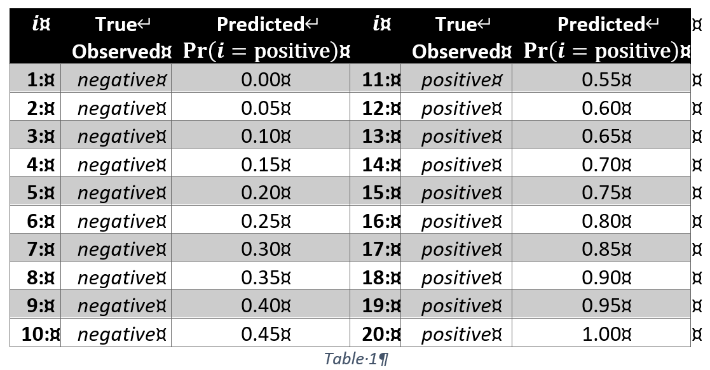
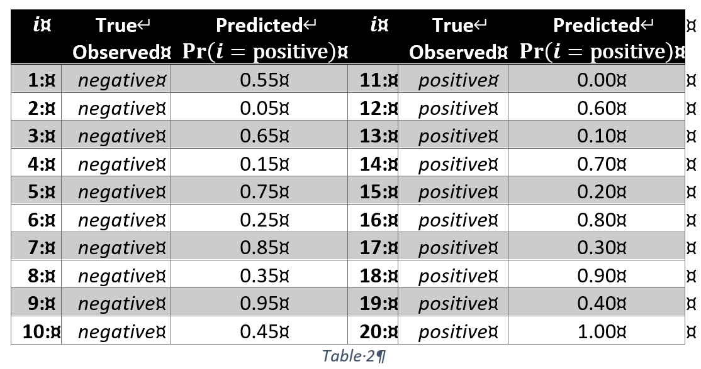

# Part 1: ROC

```{r message=FALSE, warning=FALSE}
# Helper packages
library(dplyr)       # for data wrangling
library(ggplot2)     # for awesome plotting
library(pROC)

# Modeling packages
library(rpart)       # direct engine for decision tree application
library(caret)       # meta engine for decision tree application

# Model interpretability packages
library(rpart.plot)  # for plotting decision trees
library(vip)         # for feature importance
library(pdp)         # for feature effects
```

## Task 1: Receiver Operating Curve [3 points]
[a] Calculate the sensitivity and specificity at cut-off values $π_{cut-off} =\{0.1,0.2,0.3,0.4,0.5,0.6,0.7,0.8,0.9\}$ for predicted positive probabilities $Pr⁡(i="positive")$. Also draw the associated ROC diagram.The predicted probabilities are given in the table below:


```{r}
prob <- c(seq(0,0.45,by=0.05),seq(0.55,1,by=0.05))
observation <- as.factor(c(rep("neg",10),rep("pos",10)))
pi <- seq(0.1,0.9,by = 0.1)

get_spec_and_sens <- function(observation,prob,pi){
  Sensitivity <- c()
  Specificity <- c()
  for(i in pi){
    pred <- as.factor(ifelse(prob < i, "neg","pos"))
    result  <-  caret::confusionMatrix(observation, pred, positive = "pos")
    Sensitivity <- c(Sensitivity,result$byClass[1])
    Specificity <- c(Specificity,result$byClass[2])
  }
  df <- t(as.data.frame(cbind(Sensitivity,Specificity)))
  colnames(df) <- pi
  return(df)
  
}

result <- get_spec_and_sens(observation,prob,pi)
result

```

[b] Calculate the sensitivity and specificity at cut-off $π_{cut-off} =\{0.1,0.2,0.3,0.4,0.5,0.6,0.7,0.8,0.9\}$ for predicted positive probabilities Pr⁡(i="positive" ). Also draw the associated ROC diagram. The predicted probabilities are given in the table below:


```{r}
prob2 <- c(0.55,0.05,0.65,0.15,0.75,0.25,0.85,0.35,0.95,0.45,0,0.6,0.1,0.7,0.2,0.8,0.3,0.9,0.4,1)
result2 <- get_spec_and_sens(observation,prob2,pi)
result2
```

[c] Interpret and compare both ROC diagrams with respect to their underlying data in tasks 1 [a] and [b].

Our model 1 identify those two categories quite well, the predicted probabilities of all "positive" class are larger than 0.5, so set $\pi=0.5$ is ideal for this circumstance (both specificity and sensitivity equal to 1). 
For model 2, the predicted probability of both "positive" and "negative" classes are overlapped with each other, which means our model is not doing a good job for classification. We need to make a trade-off between specificity and sensitivity.

```{r message=FALSE, warning=FALSE}
rocResult1 <- roc(observation, prob)
rocResult2 <- roc(observation, prob2)
plot(rocResult1, col="red", lwd=2)
plot(rocResult2, col="blue", lwd=2, add = TRUE)
legend("bottomright", legend=c("[b]","[a]"), lty=1, col=c("blue","red"))
title(main = paste('Area under the curve [a]:',auc(rocResult1),'; Area under the curve [b]:',auc(rocResult2)))
```

# Part 2: Trees

For the following tasks continue working with the `credit.csv` data set to predict the default probabilities. Split the data into a stratified training data set with 70% of the observations and a test data set with the remaining 30% of the observations.


## Task 2: Standard Tree [2 points]

Build tree with the control parameters `mincut=5` and `minsize=10` based of the training data set. Plot the tree. Evaluate the predictive quality of this tree using the test data set with respect to the `confusionMatrix`, `auc` and the `roc` functions. Evaluate the importance of the individual features and whether particular features were not included in building the tree.

```{r}
?read.csv
df <- read.csv('credit.csv',stringsAsFactors = TRUE)
str(df)
```


```{r fig.height=6, fig.width=10, message=FALSE, warning=FALSE}
library(tree)
set.seed(123)  # for reproducibility
index <- createDataPartition(df$default, p = 0.7, list = FALSE)
df_train <- df[index, ]
df_test  <- df[-index, ]
my_tree <- tree(default~., data=df_train,split = "deviance",control=tree.control(nobs = nrow(df_train),minsize=10, mincut=5))
```


```{r}
summary(my_tree)
```

We could know that the `checking balance`, `moths loan duration` and `other credit` are the top 3 important factors for our predicted result from the following graphs. And `years_at_residence`,`percent_of_income `,`other_credit` are not included in our model.

```{r fig.height=6, fig.width=10}
## Feature Interpretation
plot(my_tree); text(my_tree, pretty=0)
```


```{r}
pred_default <- predict(my_tree, newdata=df_test, type="class")

caret::confusionMatrix(as.factor(df_test$default), pred_default, 
                       positive = "yes",dnn = c("Reference","Prediction"))
```

```{r message=FALSE, warning=FALSE}
pred_default_prob <- predict(my_tree, newdata=df_test, type="vector")
roc_tree1 <- roc(as.factor(df_test$default), pred_default_prob[,"yes"])
plot(roc_tree1, col="red", lwd=2)
title(main = paste('Area under the curve: ',auc(roc_tree1)))
```

## Pruned Tree [2 points]

Identify an optimally pruned the tree using cross-evaluation based of the training data set. Plot the final tree Evaluate the predictive quality of this pruned tree using the test data set with respect to the `confusionMatrix`, `auc` and the `roc` functions. Evaluate the importance of the individual features.

```{r fig.height=5, fig.width=12}

set.seed(123)
cv.carseats <- cv.tree(my_tree, FUN=prune.misclass, K=10)
par(mfrow = c(1,2))
plot(cv.carseats$size, cv.carseats$dev, type="b", main="Deviance")
plot(cv.carseats$k, cv.carseats$dev, type="b", main="Complexity Parameter")
```
```{r fig.height=6, fig.width=12}
pruned_tree <- prune.misclass(my_tree, best=6)
plot(pruned_tree); text(pruned_tree, pretty=0)
```

We could know that the checking balance and months loan duration are the top 2 important factors for our predicted result from this graph. If one have enough checking balance, he would not default. If the monthly loan duration less than 2 years, he has a lower probability of default. If not, a higher probability.

The overall accuracy is the same as the standard tree.

```{r}
pred_default2 <- predict(pruned_tree, newdata=df_test, type="class")
caret::confusionMatrix(as.factor(df_test$default), pred_default2, 
                       positive = "yes",dnn = c("Reference","Prediction"))
```

```{r message=FALSE, warning=FALSE}
pred_default2_prob <- predict(pruned_tree, newdata=df_test, type="vector")
roc_tree2 <- roc(as.factor(df_test$default), pred_default2_prob[,"yes"])
plot(roc_tree2, col="red", lwd=2)
title(main = paste('Area under the curve: ',auc(roc_tree2)))
```

## Bootstrapped (Bagged) Tree [2 points]

Identify an optimally bootstrapped tree based of the training data set. Evaluate the predictive quality of this bootstrapped tree using the test data set with respect to the `confusionMatrix`, `auc` and the `roc` functions. Evaluate the importance of the individual features.

```{r}
library(ipred) 
bagged_tree <- train(
  default ~ .,
  data = df_train,
  method = "treebag",
  trControl = trainControl(method = "cv", number = 10),
  nbagg = 200,  
  control = rpart.control(minsplit = 2, cp = 0)
)
```

```{r}
pred_default2 <- predict(bagged_tree, newdata=df_test, type="raw")
caret::confusionMatrix(as.factor(df_test$default), pred_default2, 
                       positive = "yes",dnn = c("Reference","Prediction"))
```

```{r message=FALSE, warning=FALSE}
pred_default3_prob <- predict(bagged_tree, newdata=df_test, type="prob")
roc_tree3 <- roc(as.factor(df_test$default), pred_default3_prob[,"yes"])
plot(roc_tree3, col="red", lwd=2)
title(main = paste('Area under the curve: ',auc(roc_tree3)))
```

## Task 5: Random Forest [2 points]

Identify an optimal random forest using the library ranger based of the training data set. 
Evaluate the predictive quality of this random forest using the test data set with respect to the `confusionMatrix`, `auc` and the `roc` functions. Evaluate the importance of the individual features.

```{r message=FALSE, warning=FALSE}
library(ranger)    ## It is internally parallel
# number of features
n_features <- length(setdiff(names(df_train), "default"))
n_features

# train a default random forest model
default_rf <- ranger(
  default ~ ., 
  data = df_train,
  mtry = floor(n_features / 3),
  respect.unordered.factors = "order",
  seed = 123
)

# get OOB RMSE
(default_rmse <- sqrt(default_rf$prediction.error))
```

```{r}
# create hyperparameter grid
hyper_grid <- expand.grid(
  mtry = floor(n_features * c(.05, .15, .25, .333, .4)),
  min.node.size = c(1, 3, 5, 10), 
  replace = c(TRUE, FALSE),                               
  sample.fraction = c(.5, .63, .8),                       
  rmse = NA                                               
)

# execute full cartesian grid search
for(i in seq_len(nrow(hyper_grid))) {
  # fit model for ith hyperparameter combination
  fit <- ranger(
    formula         = default ~ ., 
    data            = df_train, 
    num.trees       = n_features * 10,
    mtry            = hyper_grid$mtry[i],
    min.node.size   = hyper_grid$min.node.size[i],
    replace         = hyper_grid$replace[i],
    sample.fraction = hyper_grid$sample.fraction[i],
    verbose         = FALSE,
    seed            = 123,
    respect.unordered.factors = 'order',
  )
  # export OOB error 
  hyper_grid$rmse[i] <- sqrt(fit$prediction.error)
}

# assess top 10 models
hyper_grid %>%
  arrange(rmse) %>%
  mutate(perc_gain = (default_rmse - rmse) / default_rmse * 100) %>%
  head(10)
```
```{r}
# re-run model with impurity-based variable importance
rf_impurity <- ranger(
  formula = default ~ ., 
  data = df_train, 
  num.trees = 500,
  mtry = 5,
  min.node.size = 1,
  sample.fraction = .50,
  replace = FALSE,
  probability  = TRUE,
  importance = "impurity",
  respect.unordered.factors = "order",
  verbose = FALSE,
  seed  = 123
)
```

```{r}
p1 <- vip::vip(rf_impurity, num_features = 25, bar = FALSE)
p1
```

```{r}
pred_default4 <- predict(rf_impurity, df_test)
predictions <- as.factor(ifelse(pred_default4$predictions[,"yes"] >0.5, "yes","no"))
caret::confusionMatrix(as.factor(df_test$default), predictions, 
                       positive = "yes",dnn = c("Reference","Prediction"))
```

```{r message=FALSE, warning=FALSE}
roc_tree2 <- roc(as.factor(df_test$default), pred_default4$predictions[,"yes"])
plot(roc_tree2, col="red", lwd=2)
title(main = paste('Area under the curve: ',auc(roc_tree2)))
```

## Task 6: Boosted Tree [2 points]

Identify an optimally boosted tree using the library gbm based of the training data set. Evaluate the predictive quality of this bootstrapped tree using the test data set with respect to the `confusionMatrix`, `auc` and the `roc` functions. Evaluate the importance of the individual features.

```{r message=FALSE, warning=FALSE}
library(gbm)
df_train$mydefault <- df_train$default
df_train$mydefault <- ifelse(as.character(df_train$mydefault)== "yes", 1, 0)
set.seed(123)  # for reproducibility
my_gbm <- gbm(
  formula = mydefault ~ .-default,
  data = df_train,
  distribution = "bernoulli",  # SSE loss function
  n.trees = 5000,
  cv.folds = 10
)
(best <- which.min(my_gbm$cv.error))
```

```{r}
## plot error curve
best.iter <- gbm.perf(my_gbm, method = "cv")
```

```{r}
Yhat <- predict(my_gbm, newdata = df_test, n.trees = best.iter,type = 'response')
predictions <- as.factor(ifelse(Yhat >0.5, "yes","no"))
caret::confusionMatrix(as.factor(df_test$default), predictions, 
                       positive = "yes",dnn = c("Reference","Prediction"))
```

```{r message=FALSE, warning=FALSE}
roc_tree4 <- roc(as.factor(df_test$default), Yhat)
plot(roc_tree4, col="red", lwd=2)
title(main = paste('Area under the curve: ',auc(roc_tree4)))
```


