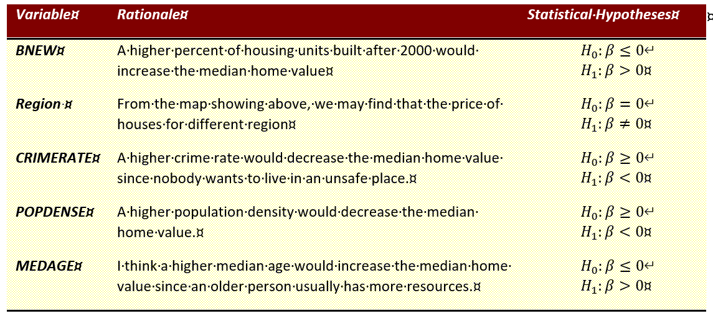

# Lab04: Extended Topics of Regression Analysis

**Objectives**: You will build, analyze and interpret an election regression model that explains the aspatial and spatial variation of median home values 2012 in Texas using its 254 counties.

**Analysis and Modelling Tasks**

Analysis Tasks

## [1] Specification of the Dependent Variable (2 points)
The dependent variable is the median home value in dollars (`MEDVALHOME`) of owner-occupied housing units for the 254 counties of Texas.

```{r message=FALSE, warning=FALSE}
# Prepare Data

library(TexMix)    ## For mapping functions
library(sp)
library(maptools);library(car)

## Get polygons of neighboring States
neig.shp <- rgdal::readOGR(dsn="TXCnty2020", layer = "TXNeighbors",
                             integer64 = "allow.loss", stringsAsFactors=T)

# Get polygons of TX counties
county.shp <- rgdal::readOGR(dsn="TXCnty2020", layer = "TXCnty2020",
                            integer64 = "allow.loss", stringsAsFactors=T)

## Get interstate layer
interState.shp <- rgdal::readOGR(dsn="TXCnty2020", layer = "InterStateHwy",
                                 integer64 = "allow.loss", stringsAsFactors=T)

cntydf <- county.shp@data

```

### [a]
Identity the **underlying statistical universe** (a.k.a population at risk) from which the median home value was estimated. This variable will be use later as weights variable to investigate any potential heteroscedasticity in your regression model.

The number of houses would contribute to the variance of median home value for each county, and cause the heteroscedasticity problem. So we would use the total number of houses in each county as our control variable.

```{r message=FALSE, warning=FALSE}
cntydf$n_house <- cntydf$OWNOCC + cntydf$RENTOCC
hist(cntydf$n_house,breaks = 20)
```

```{r fig.height=7, fig.width=12}
county.bbox <- bbox(county.shp)                             # county bounding box for map region
county.centroid <- coordinates(county.shp)                  # Get county centroids

plot(neig.shp, axes=T, col=grey(0.9),                         # first background (axes=T adds lat/long frame)
     border="white",  bg="lightblue",                         # border and background color 
     xlim=county.bbox[1,], ylim=county.bbox[2,])              # within bounding box

mapColorRamp(cntydf$n_house, county.shp, breaks=8,         # second add map
             map.title="Number of Houses", 
             legend.cex=0.8,
             legend.title="UNumber of Houses",add.to.map=T)  # add.to.map=T over-plots provinces over neighbors

plot(interState.shp, col="tomato4", lwd=1, add=T)             # insert road network for orientation
```

### [b]
Carefully evaluate the **distribution** of the median home value. Are there any missing observations that you need to deal with?

There is one county without median home value records due to the low number of residents. For safe inference, we delete this county from our dataset.

```{r}
summary(cntydf$MEDVALHOME)
hist(na.omit(cntydf$MEDVALHOME))
```

```{r}
# Delete the NA value
cntydf <-  cntydf[-which(is.na(cntydf$MEDVALHOME)),]
summary(cntydf$MEDVALHOME)
```

### [c]
Map the spatial distribution using `quantiles` and interpret the map pattern. 

From my limited geography knowledge about Texas, the higher value houses are surrounding big cities, including Dallas, San Antonio，huston, Austin.

```{r fig.height=7, fig.width=12}
plot(neig.shp, axes=T, col=grey(0.9),                         # first background (axes=T adds lat/long frame)
     border="white",  bg="lightblue",                         # border and background color 
     xlim=county.bbox[1,], ylim=county.bbox[2,])              # within bounding box

mapBiPolar(cntydf$MEDVALHOME, county.shp, break.value= mean(cntydf$MEDVALHOME),         # second add map
             neg.breaks=5, pos.breaks=5,
             map.title="Spatial distribution of Median Home Value", 
             legend.cex=0.8,
             legend.title="$ Median Home Value",add.to.map=T)  # add.to.map=T over-plots provinces over neighbors

plot(interState.shp, col="tomato4", lwd=1, add=T)             # insert road network for orientation
```

## [2] Selection of Independent Variables (2 points)

### [a]
Identify 4 to 6 potential independent metric variables plus at least one factor that you expect will influence the median home values.
We select variables from 2 perspectives:    
[A] **socio-economic**: BNEW (Percent of housing units built after 2000), URBRURAL, CRIMERATE
[B] **residential**: POPDENSE,MEDAGE

```{r}
cntydf <- transform(cntydf,
  BNEW = B2010PCT+B2000PCT
)
```


### [b] 
Formulate common-sense hypotheses why and which direction these potential independent variables will influence the median home values. 

Document items 2 [a] and [b] in a table.


## [3] Exploration of Variables (3 points)

In a scatter plot matrix or, where appropriate, box-plot: 

### [a] Explore the univariate distribution of the dependent variable.

Our original dependent variables are positively skewed. But we fix it using log-transformation.

```{r fig.height=5, fig.width=10}
par(mfrow = c(1,2))
hist(cntydf$MEDVALHOME,main = paste('Skewness =',round(e1071::skewness(cntydf$MEDVALHOME),2)),xlab= 'x')
cntydf$MEDVALHOME.log <- log(cntydf$MEDVALHOME)
hist(cntydf$MEDVALHOME.log,main = paste('After log, Skewness =',round(e1071::skewness(cntydf$MEDVALHOME.log),2)),xlab= 'x')
```

### [b] Explore the relationship of the independent variables and factor(s) with the dependent variable. 

Through the box plot, we could find an obvious difference in the median home value from place to place.
The south-central area has a comparatively high expectation. And the east has the lower median home value but high variance.

```{r fig.height=6, fig.width=8}
boxplot(cntydf$MEDVALHOME.log~cntydf$REGION, xlab = 'Region', ylab = 'log(Median Home Value)')
```

### [c] Explore the univariate and bivariate distributions of the independent metric variables. 

Since the population density is highly skewed, we need to apply a transformation to it. The rest distributions seem good enough. 

```{r fig.height=6, fig.width=9}
car::scatterplotMatrix(~ BNEW + CRIMERATE + POPDENSE + MEDAGE, data = cntydf,smooth=list(span = 0.35, lty.smooth=1, col.smooth="red", col.var="salmon"), regLine=list(col="green"))
```

### [d] Does this exploration point at any variable transformations for your initial regression model? 

```{r fig.height=5, fig.width=9}
cntydf$POPDENSE.log <- log(cntydf$POPDENSE)
par(mfrow = c(1,2))
hist(cntydf$POPDENSE.log,breaks = 12,main = paste('Tranformed POPDENSE, Skewness =',round(e1071::skewness(cntydf$POPDENSE.log),2)),xlab = 'x')
hist(cntydf$POPDENSE,breaks = 12,main = paste('Origin POPDENSE, Skewness =',round(e1071::skewness(cntydf$POPDENSE),2)),xlab = 'x')
```

## [4] Initial Trial Regression Model (4 points)

Proceed in your initial analysis with ordinary least squares. Based on the selected variables build an initial trial model and perform a thorough aspatial model diagnostics. Provide supportive plots and statistics. 

### [a]	Are all selected variables and factors relevant and do their regression coefficients exhibit the expected sign?

```{r}
library(MASS)
full.model <- lm(cntydf$MEDVALHOME.log~ CRIMERATE + POPDENSE.log + REGION + BNEW + MEDAGE, data = cntydf)
step.model <- stepAIC(full.model, direction = "both", trace = FALSE)
summary(full.model)
```

```{r}
summary(step.model)
```


### [b]	Is multicollinearity a problem? 

Vif values are all smaller than 10, so there is no multicollinearity issue.

```{r}
vif(step.model)
```

### [c]	Are the model residuals approximately normally distributed? 

```{r fig.height=6, fig.width=8, message=FALSE, warning=FALSE}
qqPlot(step.model)
```

```{r}
shapiro.test(residuals(step.model))
```

Results from the Shapiro test indicates that we could reject the none hypothesis, which means our residuals are not normally distributed. county 27 and 37 are not captured by our model.

### [d] Do you need to refine the variable transformations or add quadratic terms?

```{r fig.height=8, fig.width=10}
residualPlots(step.model)
```

The impact of BNEW is partial significant, but we still add it into our new model.

```{r}
updated.model <- update(step.model, .~.+I(BNEW^2))
# anova(step.model,updated.model)
summary(updated.model)
```

### [e] Are there influential cases and outliers present in the model?

```{r fig.height=8, fig.width=10}
car::influenceIndexPlot(updated.model)
```
[f]	Speculate why some observations appear to be “extreme” and decide what to do with these observations: Do you need to drop the associated counties from the analysis because they are not representative of the underlying population or have “unstable” variable values?

From the adjusted p-value and hat-values, counties 18,251,80, and 27 are considered as outliers. For High plains(27), the median home value is much higher than the surrounding area, we may need to consider whether to drop it. For Lower valley(80,251), the home value is much smaller than the average and high population density. All those three counties are extreme cases, which is hard to be captured by a general model. For Edwards Plateau, it is a county full of old buildings.

```{r}
apply(cntydf[,c('MEDVALHOME','POPDENSE.log','BNEW' ,'MEDAGE')], 2, summary)
```


```{r}
cntydf[c(18,27,80,251),c('MEDVALHOME','POPDENSE.log' ,'REGION' ,'BNEW' ,'MEDAGE')]
```


## [5] Revised Regression Model (2 points)

### [a] Based on what you have learned about your model in Task 4 build a revised regression model and re-check its properties. Are all identified problems from Task 4 ─ at least to some degree ─ addressed? Make sure to work with at least 4 meaningful metric variables and if the selected factor remains relevant, then keep it.

```{r}
summary(updated.model)
```

### [b] Fully interpret your final model. Does it support the hypotheses that you have formulated in Task 2?

## [6] Heteroscedasticity Investigation (2 points)
Note: The size of the reference population varies widely from county to county. Use the revised model from Task 5.

### [a] 
Estimate and interpret the parameters ${γ_0,γ_1 }$ of the multiplicative heteroscedasticity model $\sigma^2 = exp(\gamma_0*1+\gamma_1*log*(refpop_i))$

```{r}
auxreg<- lm(log(residuals(updated.model)^2)~cntydf$MEDVALHOME.log)
plot(log(residuals(updated.model)^2)~cntydf$MEDVALHOME.log); abline(auxreg, col="red")
```

it is obvious that the variance of residual is not consistent, it varies when the houses' number changes. And the slope is negative, which means variance should be smaller when the voters’ number goes larger.

###[b] Interpret the likelihood ratio test whether it is necessary to account for heteroscedasticity.
###[c] Interpret the regression parameters of your independent variables with regards to whether they or their significances are substantially different from those of your revised OLS model in Task 5.

```{r}
lm.hetero <- lmHetero(MEDVALHOME.log ~ REGION + POPDENSE.log + BNEW  + MEDAGE, hetero=~log(n_house), data=cntydf )
summary(lm.hetero)
```

The likelihood ratio test indicates the p-value is smaller than 0.05, so we can reject the null hypothesis and tentatively conclude that there has heterogeneity, so it is necessary to use the population as the weighted index. The Gamma Coefficients is -0.284 and the p-value is pretty small, which means when the number of houses goes larger, the variance of residual decrease significantly.

## [7] Spatial Residual Analysis (3 points)
For the spatial residual analysis, you can proceed either with the refined OLS model from Task 5 or, if there is significant heteroscedasticity, with heteroscedasticity model from Task 6.

### [a] Map the regression residuals of your refined OLS model in a choropleth map with a bi-polar map theme broken around the neutral zero value. 
Interpret the observed map pattern of positive and negative residuals. 

```{r}
lm.weight <- lm(MEDVALHOME.log ~ REGION + POPDENSE.log + BNEW  + MEDAGE, hetero=~log(n_house), data=cntydf ,weights=log(cntydf$n_house))
summary(lm.weight)
```

```{r}
Resid.weight <- weighted.residuals(lm.weight)
(length(Resid.weight[Resid.weight < 0]) )
```

```{r}
(length(Resid.weight[Resid.weight > 0]) )
```

```{r fig.height=8, fig.width=10}
plot(neig.shp,axes=T,col=grey(0.9),border="white",bg = 'light blue',xlim=county.bbox[1,],ylim=county.bbox[2,])               # first background
mapBiPolar(Resid.weight, county.shp, neg.breaks=6, pos.breaks=6, break.value=0.0, map.title="Refined Residuals",legend.title="Residuals", legend.cex=1.5, add.to.map=T)
plot(interState.shp, col="tomato4", lwd=1, add=T)             # insert road network for orientation
```

### [b] Generate the spatial links and plot its graph onto a map of the Texas Counties. Check whether this graph is connecting all counties properly.

```{r fig.height=6, fig.width=10}
library(maptools);library(spdep)
county.shp <-  county.shp[-which(is.na(county.shp@data$MEDVALHOME)),]

ct.link <- poly2nb(county.shp, queen=F) 
ct.centroid <- coordinates(county.shp) 
plot(neig.shp,axes=T,col=grey(0.9),border="white",bg = 'light blue',xlim=county.bbox[1,],ylim=county.bbox[2,])
plot(county.shp,col="palegreen3" ,border=grey(0.9), axes=T, add=T)
plot(ct.link,coords=ct.centroid, pch=19, cex=0.1,col="blue", add=T)
title("Spatial Links among Counties")
box()
```
### [c] Generate a Moran scatterplot of the regression residuals and interpret it.

```{r fig.height=6, fig.width=10}
ct.linkW <- nb2listw(ct.link, style="W")
spOutliers <- moran.plot(weighted.residuals(lm.weight),ct.linkW, labels=cntydf$NAME)
```

The overall pattern exhibits a positive spatial autocorrelation, which means positive residual areas are generally surrounded by other positives, vice versa.

### Test with the Moran’s I statistic whether the regression residuals of your final model are spatially independent or exhibit spatial autocorrelation.

```{r}
lm.morantest(lm.weight, ct.linkW) 
```

## [8] Estimate a Spatial Autoregressive Model (2 points)
For the SAR model you can proceed either with the refined OLS model from Task 5 or, if there is significant heteroscedasticity, with heteroscedasticity model from Task 6.

### [a] Estimate a spatial autoregressive regression model and test with a likelihood ratio test whether the spatial autoregressive model improves significantly over your refined OLS model in Task 5 (or in Task 6 if heteroscedasticity is present). 

### [b] Interpret the model. What is the spatial autocorrelation coefficient telling you? Are the estimated regression coefficients of the autoregressive model and their significances substantially different from the refined OLS model in Task 5 (or in Task 6)?

```{r message=FALSE, warning=FALSE}
rate.SAR <- spautolm(lm.weight,na.action="na.omit", listw=ct.linkW, family="SAR")
summary(rate.SAR)
```

```{r}
likeH0 <- lm.hetero$logLikeH1    # unrestrcted model
likeH1 <- logLik(rate.SAR)
cat("chi-square value:  ", chi <- -2*(likeH0[1]-likeH1[1]))
```

```{r}
cat("\nerror-probability: ", pchisq(chi, df=1, lower.tail=F))
```

The error probability is much lower than 0.05, which means the calibration of spatial autocorrelation improves our model significantly. And the lambda from the SAR model is 0.36, which indicates positive spatial autocorrelation exists in our dataset. P-value also confirms it is significant.

### [c] Test the residuals of the autoregressive model for spatial autocorrelation and comment on the result.

```{r}
moran.mc(residuals(rate.SAR), ct.linkW, nsim=9999) 
```

Results from a total of 10 thousand testings show that there is no significant spatial autocorrelation in the residual of the SAR model, which means the spatial autocorrelation in the original datasets already been eliminated by our SAR model.

